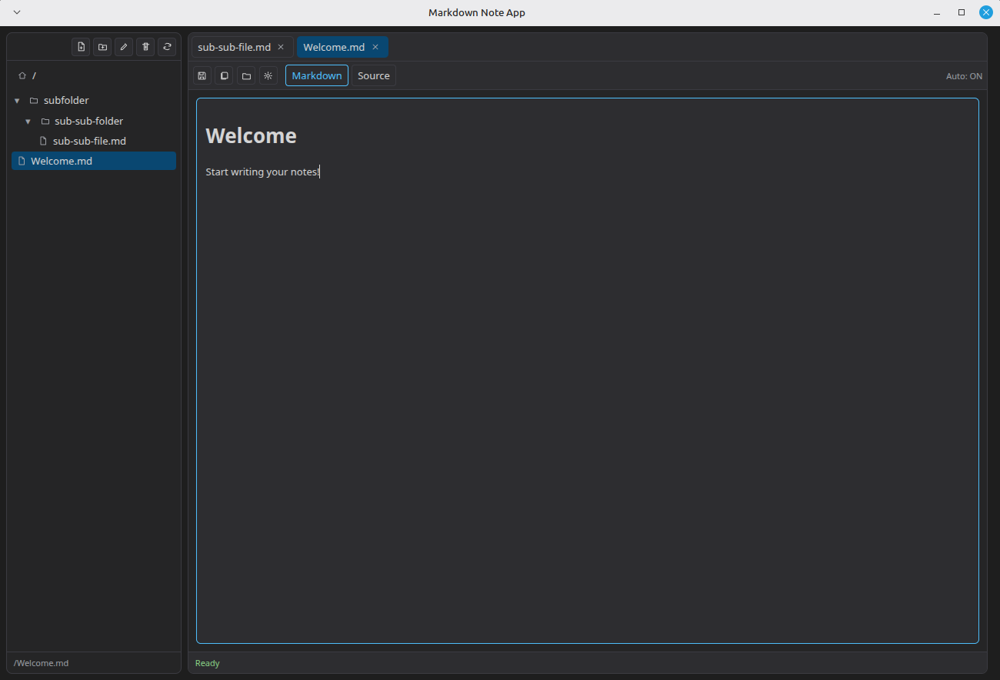

# Notes in Markdown

Desktop markdown note-taking app (Electron + React) with:

- Filesystem-backed hierarchy at `~/.nim/notes`
- Folder tree + tabbed documents
- Editable `Rendered` and `Source` modes
- Toggleable autosave
- Local conflict handling for external file edits
- Soft delete to `~/.nim/.trash` with restore

## Screenshot



## Requirements

- Node.js 20+
- npm 10+

## Run

```bash
npm install
npm run dev
```

## Build renderer

```bash
npm run build
```

Then start Electron (loads built renderer from `dist/`):

```bash
npm start
```

## Storage layout

- `~/.nim/notes/` markdown notes and folders
- `~/.nim/.trash/` soft-deleted files/folders
- `~/.nim/config.json` app settings
- `~/.nim/session.json` open tabs/expanded folders

## Tests

```bash
npm test
```

Run end-to-end smoke tests (boots Electron and validates core UI chrome):

```bash
npm run test:e2e
```

This command uses `npx @playwright/test` and does not require a permanent local Playwright dependency.

Run full test suite:

```bash
npm run test:all
```

Current coverage includes:
- Unit tests for `pathing`, `autosave`, and markdown helpers
- Integration tests for app bootstrap and note-open flow
- E2E smoke test for Electron boot + visible shell

## Packaging

```bash
npm run package:linux
npm run package:win
npm run package:mac
```

Artifacts are written to `release/`.

## GitHub Actions

- CI workflow: `.github/workflows/ci.yml`
  - runs unit/integration tests, production build, and Electron e2e smoke tests
- Release workflow: `.github/workflows/release.yml`
  - triggers on `v*` tags
  - builds platform installers and publishes to GitHub Releases via `electron-builder`

Create a release by pushing a version tag, for example:

```bash
git tag v0.1.0
git push origin v0.1.0
```
